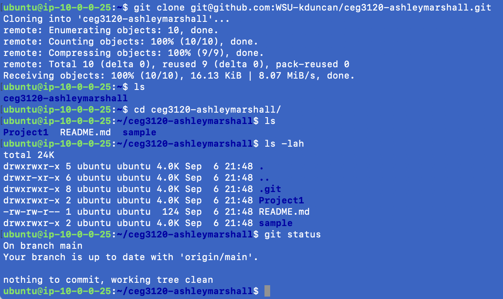
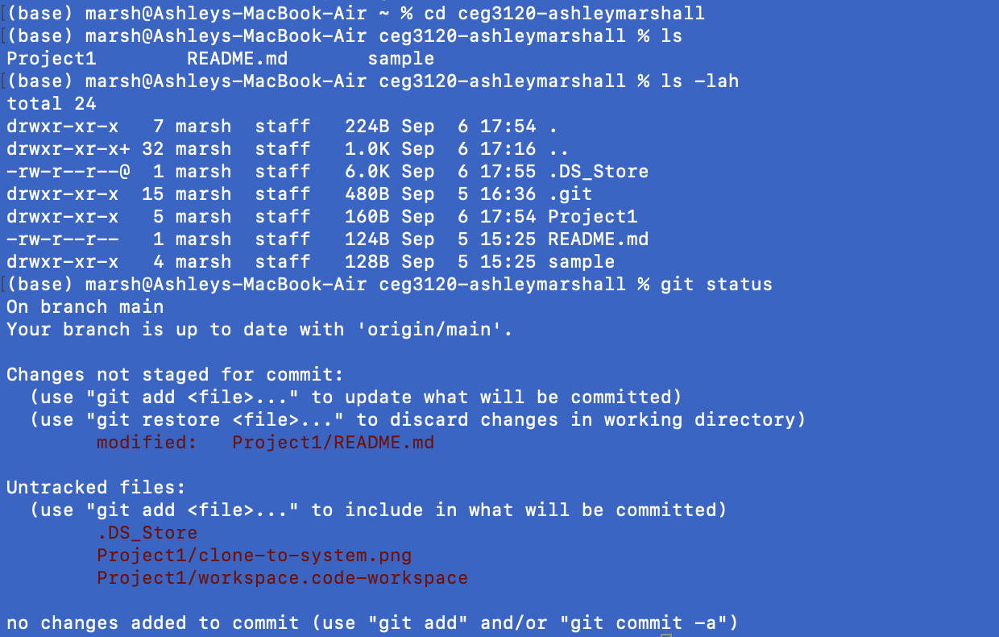

# Project 1

Our goal in project 1 was to create a git server of our own on our AWS instance. In the process, we practiced with ssh keys, markdown for this readme, and background actions involved with git.

## Setup

How to initialize a repo:

Users, permissions, keys setup:

## Usage

Guides below on git commands from a given system to the repo hosted on the AWS instance.

How to clone:
'git clone username@AWS_IP:project_creator/repo_name.git'

How to add:

How to commit:

How to push:

## Proof
Clone to AWS Ubuntu System:

Clone to Personal System:
